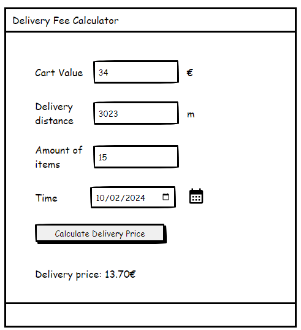

# Wolt Engineering Internship 2024 - Larkuo Wilson-Tetteh

This project is a submission of the delivery price calculator based on the rules defined in the instructions on the [Wolt App's Github](https://github.com/woltapp/engineering-internship-2024) for the 2024 engineering application.

## Running the App

To run this project, open the directory in your terminal or `cd` into the project directory. Run:

### `npm install --force`

To install the node modules for this project.

### `npm start`

To run the app in the development mode.\
Open [http://localhost:3000](http://localhost:3000) to view it in the browser.

### `npm test -- --verbose=true`

To run all the tests in verbose; listing all the passed & failed tests.

## App Screenshot
